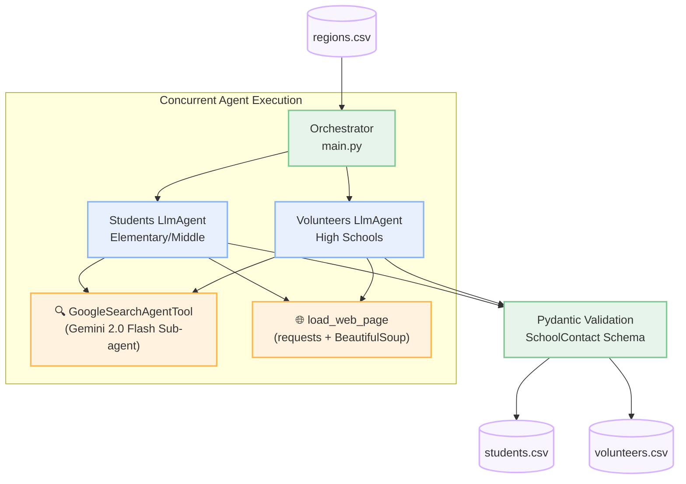

<div align="center">

# 🏫 School Outreach Research Agent

**Autonomous web research agent powered by the [Google Agent Development Kit (ADK)](https://google.github.io/adk-docs/)**


</div>

## Overview

The **School Outreach Research Agent** automates the tedious process of finding faculty contact information for educational outreach programs. 

By providing a list of target cities, the tool dispatches concurrent AI research agents to accurately identify the right contacts at local schools. This project demonstrates advanced agentic patterns, combining live web searching with direct HTML scraping to completely eliminate LLM hallucinations.

| Agent | Target Audience | Target Roles | Yield per City |
|-------|---------------|-------------|----------------|
| **Students** | Elementary & Middle Schools | Principal, Vice-Principal, STEM Coordinator | 10 contacts |
| **Volunteers** | High Schools | CS Teacher, Robotics Coach, CTE Coordinator | 12 contacts |

---

## 🏗️ Architecture & The "Anti-Hallucination" Design

A naive approach to LLM research—asking a model to "search the web for 10 school principals and their emails"—often leads to poor results. Models summarize search snippets instead of clicking through to staff directories, resulting in guessed or hallucinated email addresses.

This architecture solves that by employing a **Dual-Tool Strategy**:
1. **Google Search Sub-Agent**: Used strategically to discover official school URLs securely.
2. **Deep Web Scraper (`load_web_page`)**: Instructs the LLM to autonomously "click" into the school's staff directory, parse the raw DOM, and extract authentic, verified contact records.



### ✨ System Highlights

- **Massive Concurrency**: Processes multiple data streams asynchronously via `asyncio.gather`. The orchestrator runs the Students and Volunteers agents simultaneously on a per-region basis.
- **Sub-Agent Pattern**: Bypasses typical LLM API constraints by wrapping the built-in Gemini Search capability inside a dedicated `GoogleSearchAgentTool` sub-agent, permitting it to coexist seamlessly with custom Python function calling.
- **Strict Data Contracts**: Relies on Pydantic `BaseModel` schemas for flawless, strongly-typed JSON outputs.
- **Resilient Execution**: Employs exponential backoff out-of-the-box via the ADK `Runner` to gracefully handle API rate limits (`429`) or quota ceilings.

---

## 🛠️ Project Structure

```text
outreach/
├── data/                                  # I/O datastore
│   ├── regions.csv                        # Target list: City,State
│   ├── students.csv                       # Auto-generated leads
│   └── volunteers.csv                     # Auto-generated leads
├── src/                                   # Domain Logic
│   ├── main.py                            # Entrypoint, Agent Definition, Orchestration
│   └── models.py                          # Pydantic JSON schemas
├── scripts/                               # Interactive debug & helper utilities
├── tests/                                 # Unit & Integration tests
│   ├── test_main.py                       
│   └── test_models.py                     
├── .env                                   # API Keys & local configuration
└── pyproject.toml                         # Dependency specifications
```

---

## 🚀 Getting Started

### Prerequisites

- **Python 3.11+**
- **[uv](https://docs.astral.sh/uv/)** — Extremely fast Python package and project manager
- **Google API Key** for Gemini

### 1. Installation

Install `uv` if you haven't already:
```bash
curl -LsSf https://astral.sh/uv/install.sh | sh
```

### 2. Configuration

Get your API key from [Google AI Studio](https://aistudio.google.com/apikey).

Configure your local environment:
```bash
export GOOGLE_API_KEY="your-api-key-here"
```

### 3. Provide Targets

Populate `data/regions.csv` with your target cities:
```csv
City,State
Phoenix,AZ
Austin,TX
Columbus,OH
```

### 4. Run the Agents!

```bash
uv run src/main.py
```
*(Dependencies will be installed into a virtual environment automatically, and the research orchestration will begin).*

---

## 🧪 Testing

The codebase maintains rigorous validation via `pytest`.

To run all automated software tests:
```bash
uv run pytest
```

---

## ⚙️ advanced Configuration

Behavior parameters can be tuned directly in `src/main.py`.

| Parameter | Default | Purpose |
|----------|---------|-------------|
| `MODEL_ID` | `gemini-3-flash-preview` | The primary reasoning engine for analysis |
| `STUDENTS_TARGET` | `10` | The required yield for elementary/middle schools |
| `VOLUNTEERS_TARGET` | `12` | The required yield for high school contacts |
| `MAX_RETRIES` | `5` | API resilience retry bounds |
| `RETRY_BASE_DELAY` | `15.0` | Initial exponential backoff in seconds |

> **Note**: Search outputs depend entirely on publicly available internet data. If a school does not list faculty emails online, the `email` field will gracefully return an empty string.
