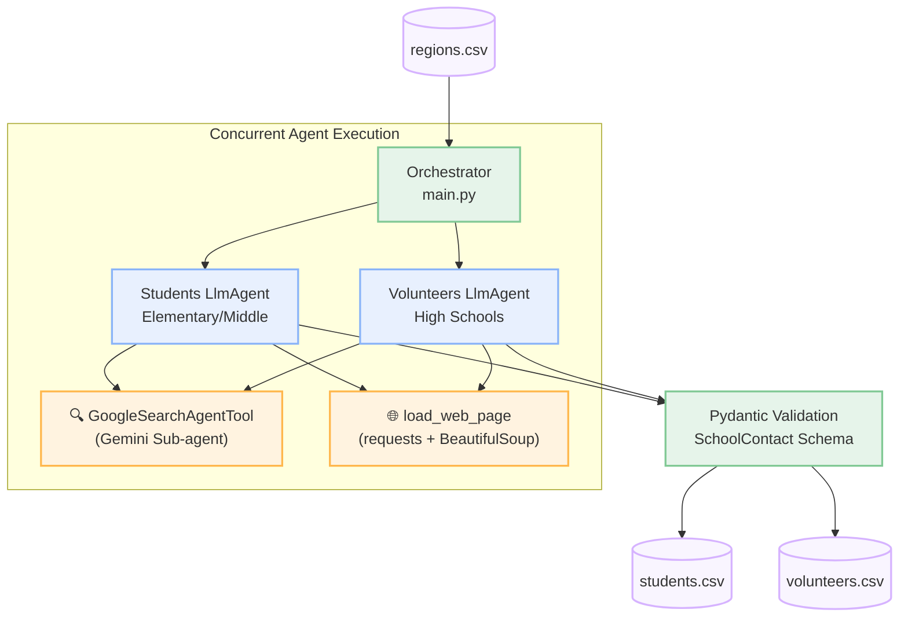

<div align="center">

# 🏫 School Outreach Research Agent

**Autonomous web research agent powered by the [Google Agent Development Kit (ADK)](https://google.github.io/adk-docs/)**


</div>

## Overview

The **School Outreach Research Agent** automates the tedious process of finding faculty contact information for educational outreach programs. 

By providing a list of target cities, the tool dispatches concurrent AI research agents to accurately identify the right contacts at local schools. This project demonstrates advanced agentic patterns, combining live web searching with direct HTML scraping to completely eliminate LLM hallucinations.

| Agent | Target Audience | Target Roles | Yield per City |
|-------|---------------|-------------|----------------|
| **Students** | Elementary & Middle Schools | Principal, Vice-Principal, STEM Coordinator | Up to 20 contacts |
| **Volunteers** | High Schools | CS Teacher, Robotics Coach, CTE Coordinator | Up to 20 contacts |

---

## 🏗️ Architecture & The "Anti-Hallucination" Design

A naive approach to LLM research—asking a model to "search the web for 10 school principals and their emails"—often leads to poor results. Models summarize search snippets instead of clicking through to staff directories, resulting in guessed or hallucinated email addresses.

This architecture solves that by employing a **Dual-Tool Strategy**:
1. **Google Search Sub-Agent**: Used strategically to discover official school URLs securely.
2. **Deep Web Scraper (`load_web_page`)**: Instructs the LLM to autonomously "click" into the school's staff directory, parse the raw DOM, and extract authentic, verified contact records.



### ✨ System Highlights

- **Massive Concurrency**: Processes multiple data streams asynchronously via `asyncio.gather`. The orchestrator runs the Students and Volunteers agents simultaneously on a per-region basis.
- **Unified Context (`ResearchApp`)**: Global dependencies like semaphores, API sessions, and LLM Runners are managed efficiently in a dedicated context dataclass to eliminate argument bloat across concurrent tasks.
- **Encapsulated I/O (`CsvRepository`)**: Safely handles asynchronous file writing and duplication checks using internal locking mechanisms, protecting the integrity of the data stream.
- **Sub-Agent Pattern**: Bypasses typical LLM API constraints by wrapping the built-in Gemini Search capability inside a dedicated `GoogleSearchAgentTool` sub-agent, permitting it to coexist seamlessly with custom Python function calling.
- **Strict Data Contracts**: Relies on `json-repair` and Pydantic `BaseModel` schemas for flawless, strongly-typed JSON outputs.
- **Progress Monitoring**: New compact logging UI that tracks per-city progress directly in the terminal (`🎓 Stud. | Seattle, WA | 0/20`), with intelligent truncation of long URLs and search queries.
- **Resilient Execution**: Employs exponential backoff out-of-the-box to gracefully handle API rate limits (`429`) or quota ceilings. Its non-blocking semaphore ensures the entire pipeline doesn't stall during individual rate-limit waits.
- **Deduplication & Resumption**: Automatically reads existing CSV outputs to deduplicate schools across multiple runs. It intelligently skips already researched schools and retries schools with missing contacts.

---

## 🔄 Resuming Work

The agent is designed for reliably building a large database over multiple sessions. If you terminate the script mid-run:

1. **State Persistence**: All found contacts are securely saved via a robust asynchronous queue mechanism and appended to `data/students.csv` and `data/volunteers.csv` **immediately** upon the conclusion of a successful city agent run.
2. **Automatic Resumption**: On restart, the agent scans these files to assess progress. Progress is evaluated against both unique school counts (`MIN_SCHOOLS_TARGET`) and total contacts (`MIN_CONTACTS_TARGET`).
3. **Smart Skip**: It will skip cities that have already reached their research thresholds. If a city was partially interrupted, it will restart the city's agent but instruct it specifically to skip already-saved schools and focus on finding *new* leads to meet the remaining requirements.

---

## 📚 Learner's Guide

Are you new to programming, AI agents, or testing? We've put together a comprehensive 4-part guide to help you understand exactly how this codebase works, from architecture to testing strategies.

1. [**01: Introduction & The ADK**](./docs/01_introduction.md) - Learn what agents are and how the Google ADK powers them.
2. [**02: Architecture and Concurrency**](./docs/02_architecture.md) - Understand the Dual-Tool anti-hallucination pattern and `asyncio` concurrency.
3. [**03: Code Walkthrough**](./docs/03_code_walkthrough.md) - Dive into `main.py`, the ADK event stream, and rate-limit retry loops.
4. [**04: Testing Guide**](./docs/04_testing_guide.md) - Learn how we achieve 94% test coverage using `pytest-asyncio` and `pytest-mock` without hitting real APIs.

---

## 🛠️ Project Structure

```text
outreach/
├── data/                                  # I/O datastore
│   ├── regions.csv                        # Target list: City,State
│   ├── students.csv                       # Auto-generated leads
│   └── volunteers.csv                     # Auto-generated leads
├── outreach/                              # Domain Logic (Source Package)
│   ├── main.py                            # Entrypoint, Orchestration, ResearchApp Context
│   ├── search.py                          # Core LLM processing and rate-limit retries
│   ├── agents.py                          # Agent and Tool instantiation
│   ├── io.py                              # Encapsulated CSV I/O (CsvRepository)
│   ├── models.py                          # Pydantic JSON schemas
│   ├── prompts.py                         # LLM System Prompts
│   └── config.py                          # Environment and global configuration
├── tests/                                 # Unit & Integration tests
│   ├── test_agents.py                     # Agent construction tests
│   ├── test_io.py                         # CSV I/O and queue tests
│   ├── test_main.py                       # Orchestration tests
│   ├── test_models.py                     # Pydantic validation tests
│   └── test_search.py                     # Agent execution, parsing, retry tests
├── docs/                                  # Learner's guide
├── .env.example                           # Environment variable template
└── pyproject.toml                         # Dependency specifications
```

---

## 🚀 Getting Started

### Prerequisites

- **Python 3.11+**
- **[uv](https://docs.astral.sh/uv/)** — Extremely fast Python package and project manager
- **Google API Key** for Gemini

### 1. Installation

Install `uv` if you haven't already:
```bash
curl -LsSf https://astral.sh/uv/install.sh | sh
```

### 2. Configuration

Get your API key from [Google AI Studio](https://aistudio.google.com/apikey).

Configure your local environment:
```bash
export GOOGLE_API_KEY="your-api-key-here"
```

### 3. Provide Targets

Populate `data/regions.csv` with your target cities:
```csv
City,State
Phoenix,AZ
Austin,TX
Columbus,OH
```

### 4. Run the Agents!

Execute the tool using `uv` to ensure dependencies are managed:
```bash
uv run outreach
```
*(This command will automatically create a virtual environment, install dependencies from `pyproject.toml`, and start the research orchestration).*

---

## 🧪 Testing

The codebase maintains rigorous validation via `pytest`.

To run all automated software tests:
```bash
uv run pytest
```

---

## ⚙️ Advanced Configuration

Behavior parameters can be tuned directly via `.env` files or system environment variables:

| Parameter | Default | Purpose |
|----------|---------|-------------|
| `MODEL_ID` | `gemini-3-flash-preview` | The primary reasoning engine for analysis |
| `MAX_CONCURRENT_AGENTS` | `15` | The number of agents executed simultaneously. Controls rate limiting. |
| `MIN_SCHOOLS_TARGET` | `3` | The minimum required unique schools per city. |
| `MIN_CONTACTS_TARGET` | `20` | The required total aggregate yield of contacts for the city. |
| `STUDENTS_TARGET` | `MIN_CONTACTS_TARGET` | Text injected into the elementary prompt for behavioral guidance. |
| `VOLUNTEERS_TARGET` | `MIN_CONTACTS_TARGET` | Text injected into the high school prompt for behavioral guidance. |

Hardcoded resilience parameters inside `outreach/config.py`:

| Parameter | Default | Purpose |
|----------|---------|-------------|
| `MAX_RETRIES` | `5` | API resilience retry bounds |
| `RETRY_BASE_DELAY` | `15.0` | Initial exponential backoff in seconds |

> **Note**: Search outputs depend entirely on publicly available internet data. If a school does not list faculty emails online, the `email` field will gracefully return an empty string.
