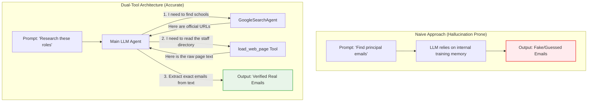
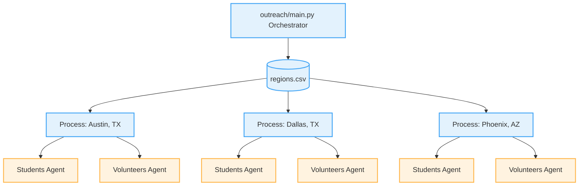

# 02: Architecture and Concurrency

Now that you know what an agent is, let's look at how this specific project is architected. We use two advanced patterns here: **Dual-Tool Strategy** to prevent hallucinations, and **Concurrency** to make the script run fast.

## The Dual-Tool Strategy

To ensure our AI never makes up data, we force it to follow a specific research path. We do this by giving it two highly specific tools.

### 1. `GoogleSearchAgentTool`
Instead of just using a raw search API, we actually use a "Sub-Agent". The ADK allows us to wrap a smaller, faster model (`gemini-2.0-flash`) into a tool specifically designed to query Google Search and read the Search Engine Results Page (SERP).
When our main agent needs to find a school, it asks the Sub-Agent to do the searching and return a reliable URL.

### 2. `load_web_page`
Once the agent has a URL, it needs to read the data on that page. `load_web_page` is a custom Python function we wrote. It uses the `requests` library to download the web page, and `BeautifulSoup` to strip away all the messy HTML tags so the LLM only sees the raw, readable text.

Here is a Mermaid diagram contrasting a naive LLM with our Dual-Tool Architecture:

## Concurrency: Making it Fast

We want to research multiple cities. Doing this one by one (synchronously) would take hours. Instead, we use **Python's `asyncio`** to do things concurrently (at the same time).

When our code reads `regions.csv`, it creates a list of cities. It then launches a "task" for each city. For every city, it launches *two* parallel agents: one looking for Students (Principals) and one looking for Volunteers (CS Teachers).

While Agent 1 is waiting for Google to respond, `asyncio` automatically flips over to Agent 2 and lets it do some work, and so on.

### The Semaphore
However, if we try to query the Google API with 100 agents at the exact same millisecond, Google will block us (this is called a Rate Limit, or `429 Too Many Requests`). 

To prevent this, we use a `Semaphore`. Think of a semaphore as a bouncer at a club. If our `MAX_CONCURRENT_CITIES` is set to 3, the semaphore only lets 3 cities process at a time. The 4th city must wait in line until one of the first 3 finishes.

---
**Next up:** Let's dive into the code itself to see how this all connects in [03: Code Walkthrough](./03_code_walkthrough.md).
