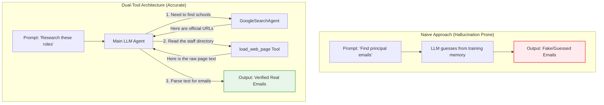

# 02: Architecture and Concurrency

Now that you know what an agent is, let's look at how this specific project is built. We use three advanced patterns here: **Dual-Tool Strategy** to prevent hallucinations, **Concurrency** to make the script run incredibly fast, and **Asynchronous Queues** to handle saving data safely.

## The Dual-Tool Strategy

To guarantee our AI never hallucinates fake emails, we restrict its behavior using two highly specific tools defined in `outreach/agents.py`.

### 1. `GoogleSearchAgentTool`
Instead of just using a raw, basic search plugin, we actually use a "Sub-Agent". The ADK allows us to wrap a smaller, faster model (using the same `MODEL_ID` like `gemini-3-flash-preview`) into a tool specifically designed just to query Google Search and read the Search Engine Results Page.
When our main agent needs to find a school, it asks this Sub-Agent to do the searching and return a reliable, exact URL.

### 2. `load_web_page` & Strict Timeouts
Once the agent has a URL, it needs to read the data on that page. `load_web_page` is a custom Python function we wrote. It downloads the web page and strips away all the messy HTML tags so the LLM only sees the raw, readable text.

**The Timeout Catch**: What if the website is broken or stuck loading forever? If our code just waited, the agent would freeze entirely. We protect against this by wrapping our scraper in a strict 15-second `timeout=15.0`. If a website takes too long, we automatically return a text string to the LLM saying, *"Error: Failed to load"*, which allows the LLM to gracefully give up on that bad link and try another one!

Here is a diagram showing how this tool flow guarantees accuracy:

## Concurrency: The Kitchen Analogy

We need to research dozens of cities. Doing this one by one (synchronously) would take hours. Instead, we use **Python's `asyncio`** library.

**Analogy:** Imagine a chef in a kitchen. Synchronous code means the chef puts a pot of water on the stove and stands there staring at it for 10 minutes until it boils, doing nothing else. `asyncio` means the chef puts the water on the stove, *immediately walks away* to chop onions, and only returns to the stove when the buzzer goes off. 

When our code reads `regions.csv`, it creates a list of cities. It then launches a "task" for each city. For *every single city*, it launches *two parallel agents*: one looking for Students (Principals) and one looking for Volunteers (CS Teachers). Any time an agent is waiting for Google to respond (water boiling), `asyncio` switches focus to another agent (chopping onions). They all process seamlessly overlapping each other.

### The Semaphore (The Bouncer)
However, if we ask the Google API to run 100 agents at the exact same millisecond, Google will block us with an error (`429 Too Many Requests`). 

To prevent this, we use a `Semaphore`. Think of a semaphore as a bouncer at a club. If our `MAX_CONCURRENT_AGENTS` in `config.py` is set to 15, the bouncer only lets 15 agents inside at once. The 16th agent must wait in line outside until one of the first 15 finishes and leaves.

### Asynchronous Queues for CSV I/O (The Mail Drop)
When an agent finds a school contact, we need to save it to our `students.csv` file. 

If all 15 concurrent agents tried to write to the same file at the exact same time, the file would get horribly corrupted. Originally, programmers used a "Lock" (which acts like a bathroom key where only one agent goes in at a time). But Locks are slow bottlenecks!

Instead, we use the **Actor Pattern** inside `io.py` via an `asyncio.Queue()`. 
**Analogy:** The queue is a mail drop box. Agents don't open the file; they just drop their contacts into the slot and instantly get back to work! Behind the scenes, we have a quiet background worker task that pulls the envelopes out of the box one by one and safely writes them to the CSV.

---
**Next up:** Let's dive into the core event loop and LLM parsing logic in [03: Code Walkthrough](./03_code_walkthrough.md).
