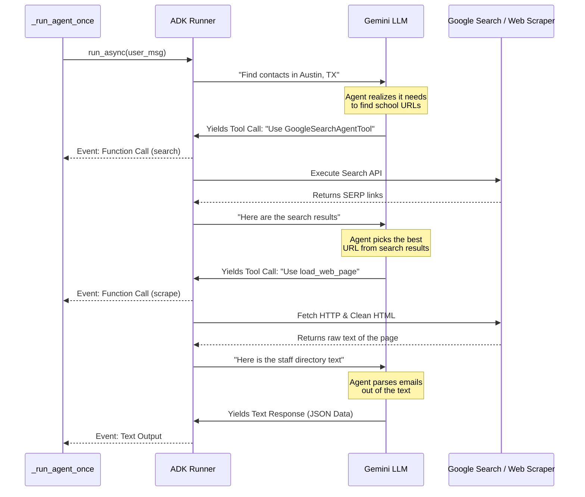

# 03: Code Walkthrough

This guide walks you through `src/main.py`, focusing on the core logic: the ADK `Runner` streaming events, the data parser extracting structured JSON, and the retry loops.

## The Overall Flow

At a high level, the `main()` function:
1. Validates prerequisites (CSV exists, API Key exists).
2. Reads the target cities from `data/regions.csv`.
3. Checks output files (`students.csv`, `volunteers.csv`) to skip cities we've already researched.
4. Uses `asyncio.gather` to launch tasks for all pending cities concurrently, gated by a `Semaphore` so we don't overwhelm Google.

## How the ADK `Runner` Works (`_run_agent_once`)

When we process a city, we call `_run_agent_once()`. This is where the ADK does the heavy lifting. We construct a plain English prompt like `"Find school contacts in Austin, TX"`, package it as a `user_msg`, and feed it to the `Runner`. 

Instead of waiting for one massive response, the `Runner` **streams events back to us** in real time as the agent "thinks" and interacts with tools. Let's look at exactly what happens under the hood when the Runner executes:



Because the Runner yields events back to our generator (`async for event in runner.run_async(...)`), we can intercept `FunctionCalls` to log them nicely in the terminal, giving us a live dashboard showing *exactly* what website the agent is scraping at any given second. 

When the agent finally figures out the answer and writes its JSON object, it sends that back as `Text Output`, and we append it all into an `collected_text` string block.

## Coercing LLM Dust into Diamonds (`parse_agent_response`)

The output of an LLM can be messy. Even if you ask for JSON, the LLM might reply with:
```
Here is the data you requested:
```json
{ "contacts": [{"school_name": "Test", "faculty_name": "John"}]}
```
Hope this helps!
```
If we run Python's built-in `json.loads()` on this, it will instantly crash because of the markdown fences and surrounding chat text. 

To solve this, we use the library **`json-repair`**. We simply pass `json_repair.loads(text)` and it automatically strips the markdown, fixes unescaped characters, adds missing brackets, and gives us a clean Python dictionary.

Next, we validate that dictionary against our **Pydantic Model** (`SchoolContact`). Pydantic enforces types (strings must be strings, missing URLs should default to `""`). If the LLM invents a new field or forgets a required one, Pydantic throws an error, preventing corrupt data from ruining our output CSVs. We call `SchoolContact.model_validate(item)` over a `try/except` loop so one malformed row doesn't break the whole list.

## Escaping Rate Limits (`search_city`)

Google places strict limits on how many API calls you can make per minute (Quota limits / 429 Too Many Requests). When you process 50 cities with 2 agents each, you *will* hit these limits.

Instead of crashing the program, we use **Exponential Backoff** wrapped around our runner in `search_city(...)`:

1. It attempts the call (`_run_agent_once`).
2. If it catches an Exception with "429" or "RESOURCE_EXHAUSTED", it calculates a delay time.
3. The formula `delay = RETRY_BASE_DELAY * (2 ** attempt)` means the delay doubles every time: 15 seconds -> 30 seconds -> 60 seconds.
4. It calls `await asyncio.sleep(delay)`, pausing *just this specific city's task* without stopping the rest of the app!
5. After sleeping, the loop reiterates and checks again, for up to `MAX_RETRIES`.

---

**Next up:** Learn how to write software tests to ensure all of this logic works perfectly without ever hitting the live internet in [04: Testing Guide](./04_testing_guide.md).
