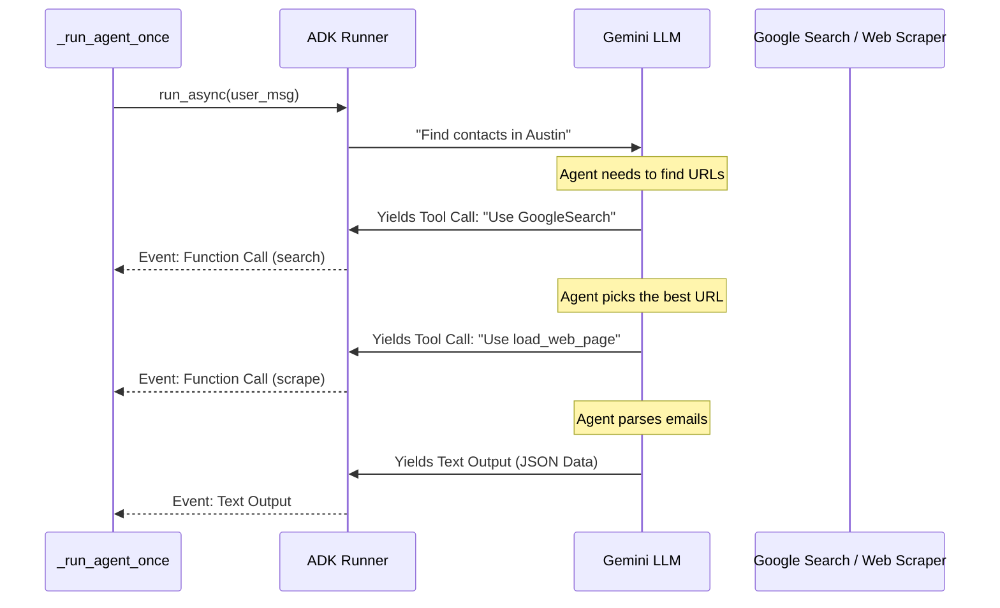

# 03: Code Walkthrough

This guide walks you through the core logic of the application, focusing on `outreach/main.py` (the orchestrator) and `outreach/search.py` (where the AI actually talks to the internet).

## The Overall Flow (`main.py`)

At a high level, the `main()` function is the boss. It tells everyone what to do:
1. Validates that you have a `regions.csv` file and a Google API Key.
2. Checks the `students.csv` and `volunteers.csv` files to see what cities you've already finished, so it can skip them and save time.
3. Groups all the remaining cities together and uses `asyncio.gather` to launch them all at the exact same time (remember the Chef kitchen analogy from Chapter 2).

### Trapping Sneaky Errors
When `asyncio.gather` runs 30 agents at once, what happens if *one* agent crashes because of a weird website? Normally, the whole program would explode and crash.
We fix this by using `return_exceptions=True`. This tells Python: *"If an agent crashes, just hand me the Error object quietly, but let the other 29 agents keep working!"* Afterwards, `main()` loops through the results, finds any sneaky exceptions, and prints them out nicely so you can fix them later.

### Graceful Shutdown (Closing the Mailbox)
At the very end of `main()`, we call `await volunteers_repo.shutdown()`. 
Because our agents send data to a background queue (the mail drop box), if the program just suddenly stopped at the end, the background worker might not have finished writing the last 5 envelopes to the CSV file! 
`shutdown()` acts like locking the doors and waiting until the worker guarantees every last piece of mail has been securely written.

## How the ADK `Runner` Works (`search.py`)

When we launch an agent for a city, we call `_run_agent_once()`. We construct a simple English sentence like `"Find school contacts in Austin, TX"`, and feed it to the ADK `Runner`. 

Instead of freezing for 60 seconds and handing back a massive block of text, the `Runner` **streams events back to us** in real time as the agent "thinks". 

Because the Runner streams `Events` back to us, we can watch them live! When we detect a `FunctionCall`, our terminal prints out *"Scraping Website X"*. It's like a live dashboard.

### Keeping the AI Focused (The "Lost in the Middle" Problem)
If we run a city like Chicago that has 100 schools, we don't want the agent finding the *same* school twice. So, we inject a list of "Already Found Schools" into the prompt. 
However, if that list gets to be 80 schools long, the LLM prompt becomes enormous. AI models suffer from the "Lost in the Middle" phenomenon—if you give them too much text, they get distracted and forget the core instructions.
To fix this, we clip the list to only the **last 20 schools** and simply add a note saying `(and 60 others)`. The LLM stays laser-focused and runs faster!

## Structured Output & Parsing the JSON

When the AI finds emails, we force it to reply in strict **JSON format** (a data format computers can easily read) instead of conversational English. We do this by defining a Pydantic `output_schema` in the agent configuration.

As the `Runner` streams back this JSON text chunk by chunk, we collect all the pieces into one big string. When the stream is completely finished, we call `parse_agent_response()`:

1. **`json-repair`**: Sometimes, the LLM makes a tiny typo (missing a final bracket `}`). A regular `json.loads` would crash the whole app. We use a library called `json-repair` which acts like an autocorrect, fixing broken brackets instantly.
2. **Pydantic Validation**: We then force the data into our strict `SchoolSearchResult` model. This guarantees that every contact actually has a "School Name", a "Faculty Name", and an "Email" before we allow it to be saved to the database.

---

**Next up:** Learn how to write software tests to ensure all of this logic works perfectly without ever hitting the live internet in [04: Testing Guide](./04_testing_guide.md).
