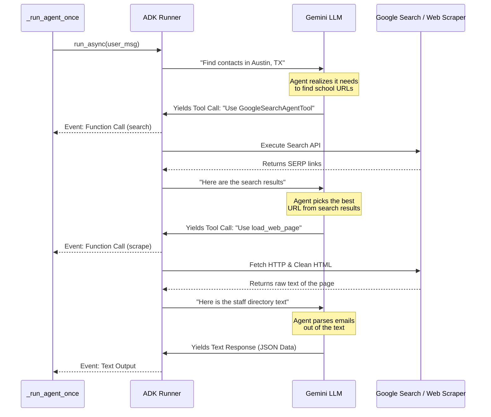

# 03: Code Walkthrough

This guide walks you through the core logic of the application, focusing on `outreach/main.py` (orchestration) and `outreach/search.py` (the ADK `Runner` streaming events, the data parser, and the retry loops).

## The Overall Flow

At a high level, the `main()` function:
1. Validates prerequisites (CSV exists, API Key exists).
2. Reads the target cities from `data/regions.csv`.
3. Checks output files to evaluate previous progress against minimum thresholds (`MIN_SCHOOLS_TARGET`, `MIN_CONTACTS_TARGET`). If the city satisfies both, it skips it.
4. Uses `asyncio.gather` to launch tasks for all pending cities concurrently, gated by a `Semaphore` so we don't overwhelm Google.

## How the ADK `Runner` Works (`outreach/search.py`)

When we process a city, we call `_run_agent_once()`. This is where the ADK does the heavy lifting. We construct a plain English prompt like `"Find school contacts in Austin, TX"`, package it as a `user_msg`, and feed it to the `Runner`. 

Instead of waiting for one massive response, the `Runner` **streams events back to us** in real time as the agent "thinks" and interacts with tools. Let's look at exactly what happens under the hood when the Runner executes:



Because the Runner yields events back to our generator (`async for event in runner.run_async(...)`), we can intercept `FunctionCalls` to log them nicely in the terminal, giving us a live dashboard showing *exactly* what website the agent is scraping at any given second. 

As the agent gathers information, it streams back `Text Output` representing the JSON structured array. Crucially, we parse this `collected_text` **on every single iteration of the loop**. 

By running `json-repair` on the partial text array, we can detect the exact moment a new `SchoolContact` object becomes fully formed. Once detected, we immediately wrap the append operation in a `csv_lock` and write the new contact straight to the output dataset. This **Progressive Streaming** guarantees no data loss in the event of an interruption.

## Structured Output via `output_schema`

Because we define an `output_schema` (the `SchoolSearchResult` Pydantic model) when building our agent in `outreach/agents.py`, the Google ADK ensures that the LLM's final response is **pure valid JSON**. 

Unlike older LLM patterns where you might get conversational "noise" (like "Here is your JSON:"), the Gemini model uses constrained decoding to strictly output only the fields defined in our model. 

```json
{
  "contacts": [
    {
      "school_name": "Test Academy",
      "faculty_name": "John Doe",
      "email": "j.doe@test.edu"
    }
  ]
}
```

## Parsing the Response (`parse_agent_response`)

Even though the output is structured, we still want our code to be bulletproof. Our `parse_agent_response` function handles the final conversion:

1. **`json-repair`**: We use the `json_repair` library instead of `json.loads()`. If the LLM output is truncated or has minor syntax errors (like missing trailing brackets), `json-repair` automatically fixes them.
2. **Pydantic Validation**: We pass the repaired JSON into `SchoolSearchResult.model_validate()`. This ensures all data types are correct and all required fields are present.
3. **Resilience Loop**: If a specific contact item is malformed but the rest are fine, we try to parse each contact individually so we don't lose the entire batch.


## Escaping Rate Limits (`search_city`)

Google places strict limits on how many API calls you can make per minute (Quota limits / 429 Too Many Requests). When you process 50 cities with 2 agents each, you *will* hit these limits.

Instead of crashing the program, we use **Exponential Backoff** wrapped around our runner in `search_city(...)`:

1. It attempts the call (`_run_agent_once`).
2. If it catches an Exception with "429" or "RESOURCE_EXHAUSTED", it calculates a delay time.
3. The formula `delay = RETRY_BASE_DELAY * (2 ** attempt)` means the delay doubles every time: 15 seconds -> 30 seconds -> 60 seconds.
4. It calls `await asyncio.sleep(delay)`, pausing *just this specific city's task* without stopping the rest of the app!
5. After sleeping, the loop reiterates and checks again, for up to `MAX_RETRIES`.

---

**Next up:** Learn how to write software tests to ensure all of this logic works perfectly without ever hitting the live internet in [04: Testing Guide](./04_testing_guide.md).
